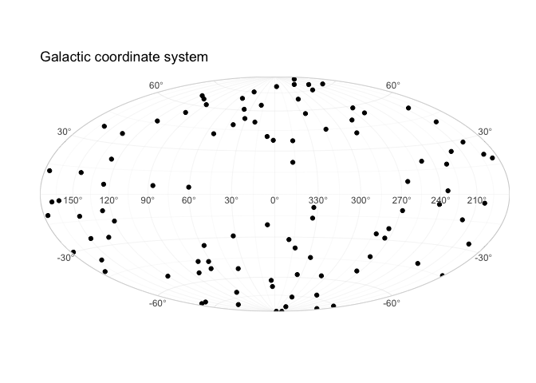
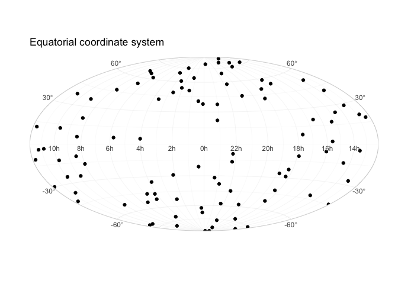

<!-- README.md is generated from README.Rmd. Please edit that file -->

<!-- badges: start -->

[](https://CRAN.R-project.org/package=ggsky)
[](https://lifecycle.r-lib.org/articles/stages.html#stable)
<!-- badges: end -->

# ggsky

`ggsky` is an extension for `ggplot2` to draw sky maps with:

- galactic coordinates (`coord_galactic()`)

- equatorial coordinates (`coord_equatorial()`)

It includes custom coordinate systems and helper scales for
longitude/latitude labels.

## Installation

From GitHub:

``` r
#install.packages("ggsky")
library(ggsky)
```

## Quick examples

``` r
library(ggplot2)
#> Warning: package 'ggplot2' was built under R version 4.5.2
theme_set(theme_light())

N <- 100
df1 <- data.frame(
  x = runif(N, 0, 360),
  y = runif(N, -90, 90)
)

ggplot(df1, aes(x, y)) +
  geom_point() +
  coord_galactic() +
  labs(title = "Galactic coordinate system")
```



``` r
ggplot(df1, aes(x, y)) +
  geom_point() +
  labs(title = "Equatorial coordinate system") +
  coord_equatorial()
```


