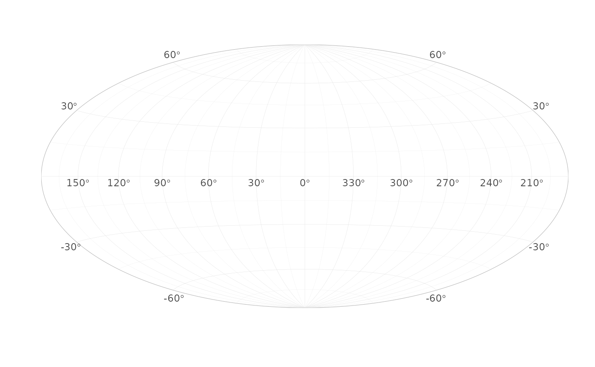
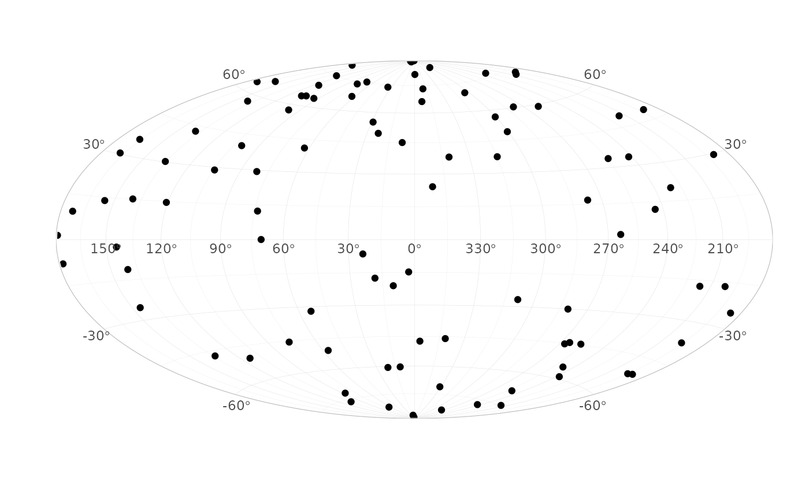
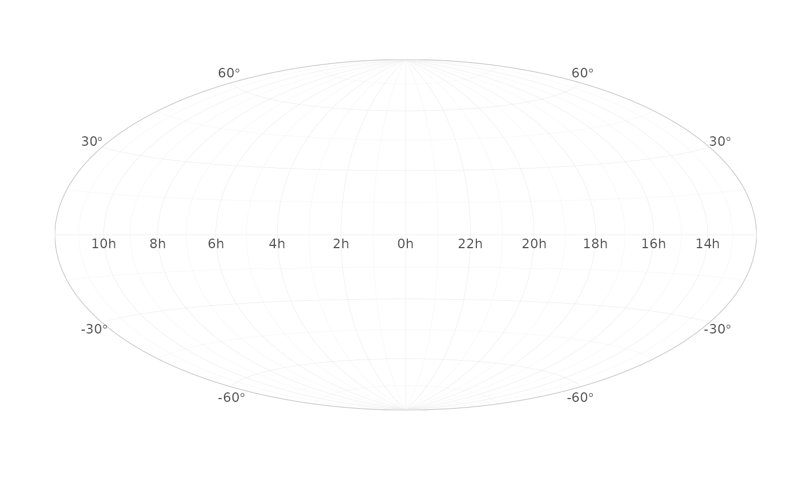
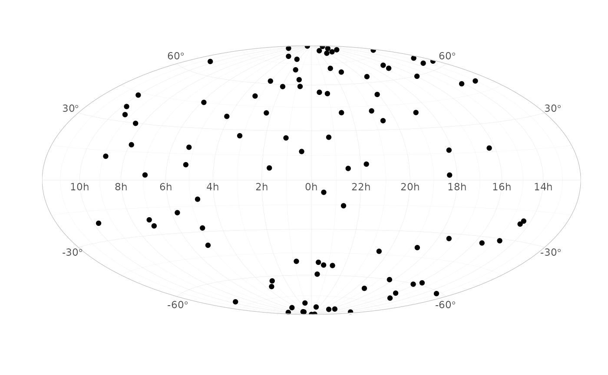
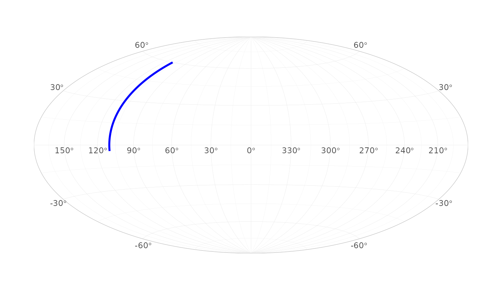
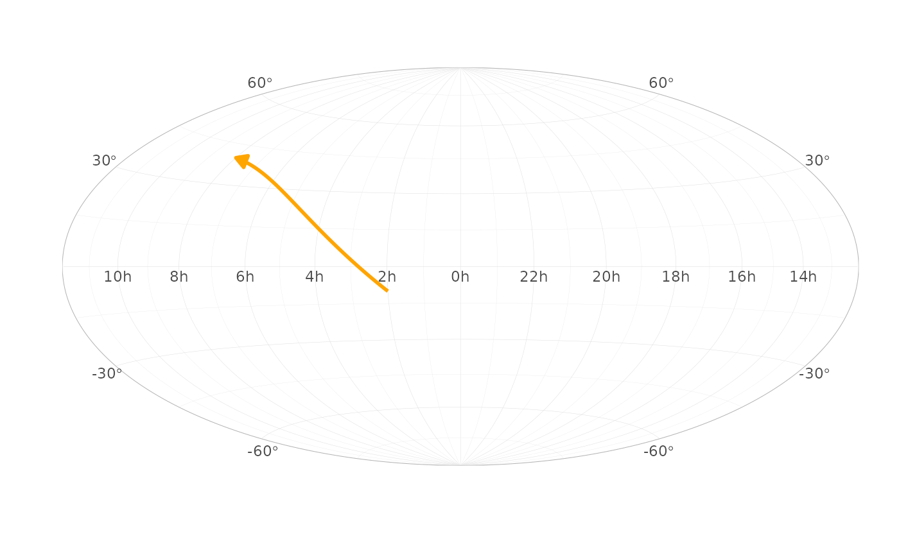
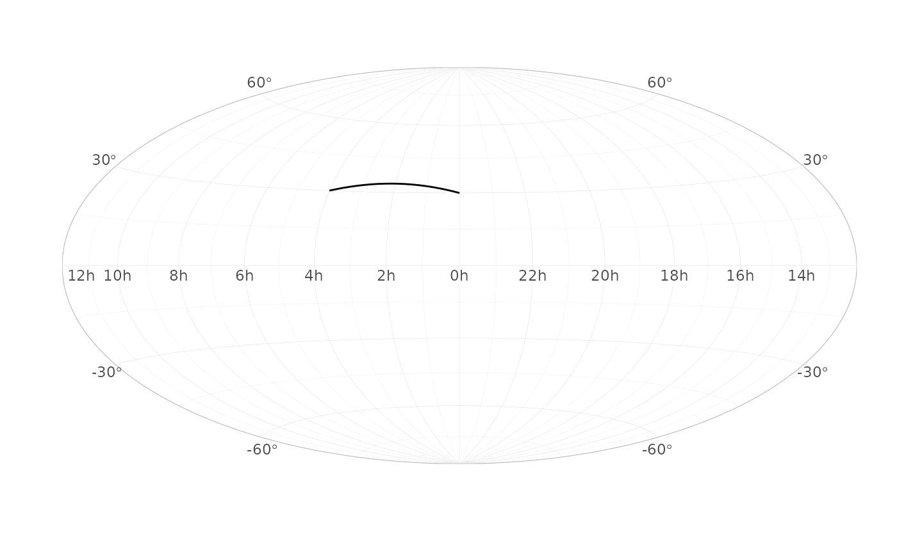
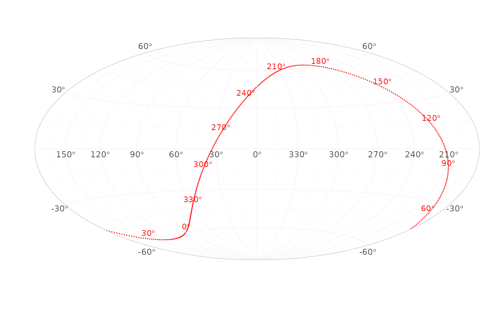

# Get started

`TL;DR: ggsky adds galactic and equatorial sky-map coordinates to ggplot2, so you can plot points, paths, and segments on a Hammer projection with readable sky-grid labels.`

``` r
library(ggsky)
library(ggplot2)
theme_set(theme_light())
```

## Coordinate Systems

### Galactic Coordinate System

``` r
ggplot() +
  coord_galactic()
```



``` r
N <- 100
df_gal <- data.frame(
  l = runif(N, 0, 360), 
  b = runif(N, -90, 90)
)

ggplot(df_gal, aes(l, b)) +
  geom_point() +
  coord_galactic()
```



Galactic longitude vs latitude.

### Equatorial coordinate system

``` r
ggplot() +
  coord_equatorial()
```



``` r
df1 <- data.frame(
  ra = runif(N, 0, 360),
  dec = runif(N, -90, 90)
)

ggplot(df1, aes(ra, dec)) +
  geom_point() +
  coord_equatorial()
```



Right ascension versus declination. Coordinates `ra` and `dec` must be
in degrees.

## Custom geoms

### `geom_path`

It projects geom_path between points along [Great
circle](https://en.wikipedia.org/wiki/Great_circle), i.e., the shortest
path on the sky map.

``` r
df_path_gal <- data.frame(
  l = c(110, 110),
  b = c(-4, 60),
  g = 1
)

ggplot(df_path_gal, aes(l, b, group = g)) +
  geom_path(colour = "blue", linewidth = 1) +
  coord_galactic()
```



### `geom_segment`

``` r
df_seg_eq <- data.frame(
  x = 30, y = -10,
  xend = 120, yend = 40
)

ggplot(df_seg_eq) +
  geom_segment(
    aes(x = x, y = y, xend = xend, yend = yend),
    linewidth = 1, colour = "orange",
    arrow = arrow(type = "closed", length = unit(0.1, "inches"))
  ) +
  coord_equatorial()
```



### Custom scales

[`scale_gal_lat()`](https://uskovgs.github.io/ggsky/reference/scale_gal_lat.md),
[`scale_gal_lon()`](https://uskovgs.github.io/ggsky/reference/scale_gal_lon.md),
[`scale_eq_ra()`](https://uskovgs.github.io/ggsky/reference/scale_eq_ra.md),
[`scale_eq_dec()`](https://uskovgs.github.io/ggsky/reference/scale_eq_dec.md)

``` r
df_path_eq <- data.frame(
  ra = c(0, 60),
  dec = c(30, 30),
  g = 1
)

ggplot(df_path_eq, aes(ra, dec, group = g)) +
  geom_path() +
  coord_equatorial() +
  scale_eq_ra(breaks = seq(0, 330, by = 30))
```



## Plot celestial equator on galactic plane

Use built-in dataset `equator`.

``` r
ggplot(equator, aes(l, b)) +
  geom_path(linetype = "dotted", color = "red") +
  geom_text(
    data = subset(equator, ra %% 30 == 0),
    aes(label = sprintf("%d*degree", ra)),
    parse = TRUE,
    vjust = -0.5,
    size = 3,
    color = "red"
  ) +
  coord_galactic()
```


