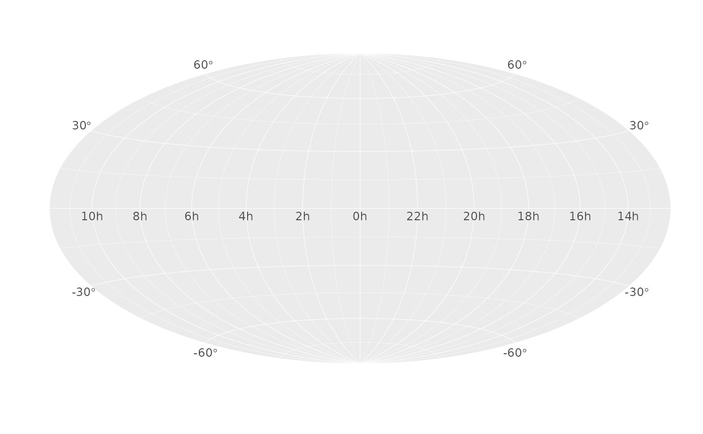
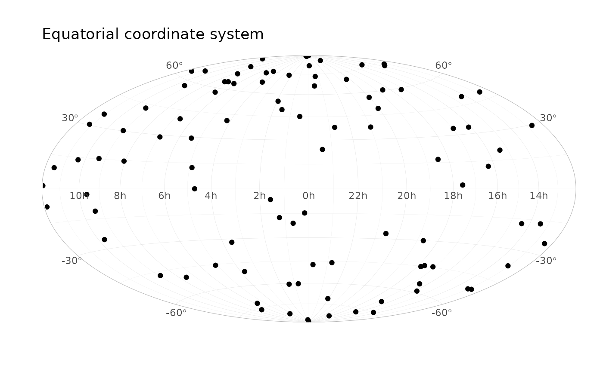

# Coordinate systems

``` r
library(ggsky)
library(ggplot2)
```

``` r
ggplot() +
  coord_galactic()
```


``` r

ggplot() +
  coord_equatorial()
```



``` r
N <- 100
df1 <- data.frame(
  x = runif(N, 0, 360),
  y = runif(N, -90, 90)
)

ggplot(df1, aes(x, y)) +
  geom_point() +
  coord_galactic() +
  labs(title = "Galactic coordinate system") +
  theme_light()
```


``` r

ggplot(df1, aes(x, y)) +
  geom_point() +
  labs(title = "Equatorial coordinate system") +
  coord_equatorial() +
  theme_light()
```



## `geom_path`

``` r
df_path_gal <- data.frame(
  l = c(110, 110),
  b = c(-4, 60),
  g = 1
)

ggplot(df_path_gal, aes(l, b, group = g)) +
  geom_path(colour = "blue", linewidth = 1) +
  coord_galactic() +
  theme_light()
```


``` r
df_path_eq <- data.frame(
  ra = c(0, 60),
  dec = c(30, 30),
  g = 1
)

ggplot(df_path_eq, aes(ra, dec, group = g)) +
  geom_path() +
  coord_equatorial() +
  scale_eq_ra(breaks = seq(0, 330, by = 30)) +
  theme_light()
```


``` r
# 5) Equatorial + geom_segment
df_seg_eq <- data.frame(
  x = 30, y = -10,
  xend = 120, yend = 40
)

ggplot(df_seg_eq) +
  geom_segment(
    aes(x = x, y = y, xend = xend, yend = yend),
    linewidth = 1, colour = "orange",
    arrow = arrow(type = "closed", length = unit(0.1, "inches"))
  ) +
  coord_equatorial() +
  theme_light()
```


## Plot sky equator on galactic plane

``` r
library(dplyr)
library(latex2exp)
# devtools::install_github("uskovgs/xrayr")


df1 <- data.frame(
  l = c(120, 120, 0, 0, 0, 120),
  b = c(0, 60, 60, 60, 0, 0)
)

coords_eq0 <- xrayr::ra_dec(0:359, rep(0.000001, 360))
coords_eq0_gal <- xrayr::to_galactic(coords_eq0)
df_eq0 <- data.frame(
  l = coords_eq0_gal$l,
  b = coords_eq0_gal$b,
  ra = xrayr::ra(coords_eq0)
)

ggplot(df1, aes(l, b)) +
  geom_path(colour = "blue", linewidth = 0.8) +
  geom_path(
    data = df_eq0, aes(l, b), colour = "red",
    linetype = "dotted"
  ) +
  geom_text(
    data = dplyr::filter(df_eq0, ra %% 30 == 0),
    aes(label = latex2exp::TeX(paste0("$", ra, "^\\circ$"), output = "character")),
    parse = TRUE,
    vjust = -0.5,
    size = 3,
    color = "red"
  ) +
  coord_galactic()
```
