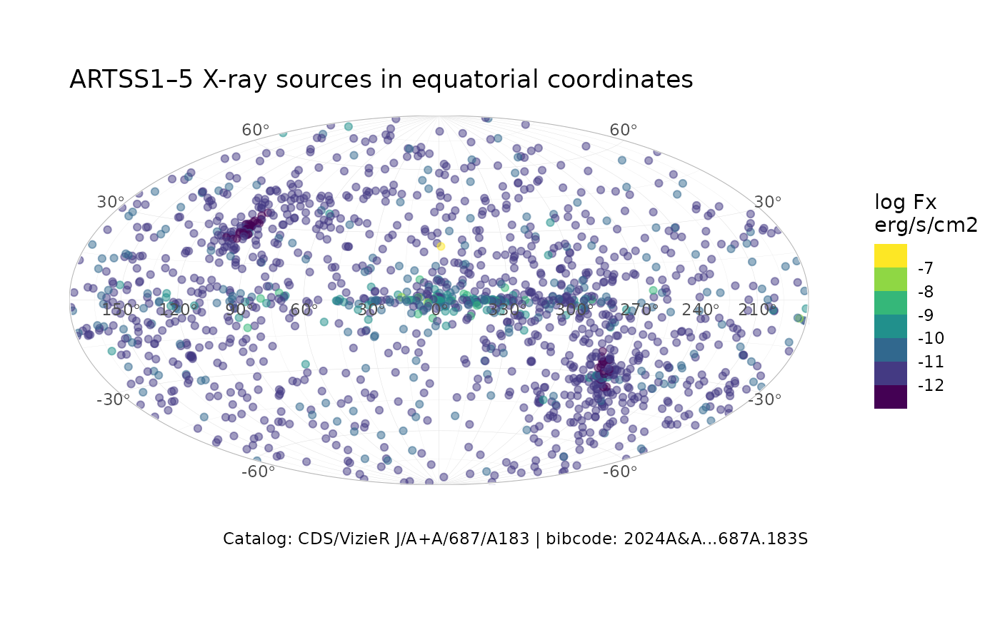

# Plot X-ray source catalog

``` r
library(ggsky)
library(ggplot2)
```

## Prepare data

## Plot

``` r
ggplot(artss15, aes(l, b, color = log10(flux))) +
  geom_point(alpha = 0.5) +
  scale_color_viridis_b() +
  labs(
    title = "ARTSS1–5 X-ray sources in equatorial coordinates",
    caption = "Catalog: CDS/VizieR J/A+A/687/A183 | bibcode: 2024A&A...687A.183S",
    color = "log Fx\nerg/s/cm2"
  ) +
  theme_light() +
  coord_galactic() +
  theme(
    plot.background = element_blank()
  ) 
```


